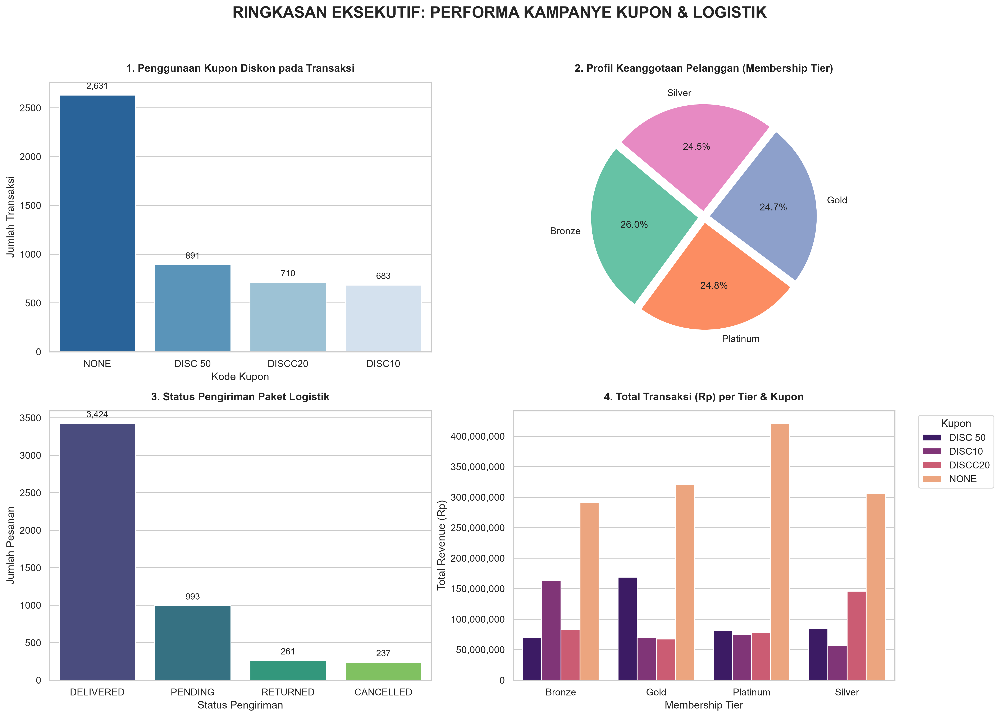

# Proyek Analisis & Pipeline Data Retail - Logistik

Dokumentasi ini berisi penjelasan struktur file, panduan penggunaan, serta skema data untuk proyek pengelolaan, pembuatan, dan analisis data retail serta logistik.

## 📌 Daftar Isi

1. [Deskripsi Proyek](#deskripsi-proyek)
2. [Struktur Repositori](#struktur-repositori)
3. [Penjelasan File & Script](#penjelasan-file--script)
4. [Persyaratan Sistem (Dependencies)](#persyaratan-sistem-dependencies)
5. [Panduan Penggunaan](#panduan-penggunaan)
6. [Menampilkan & Push Gambar Dashboard (PNG)](#-menampilkan--push-gambar-dashboard-png)
7. [Kamus Data & Struktur Data](#kamus-data--struktur-data)

## 📝 Deskripsi Proyek

Proyek ini dirancang untuk memproses, mensimulasikan, dan menganalisis aliran data operasional pada sektor retail dan logistik. Repositori ini menyediakan:

* **Generator Data**: Script Python untuk menghasilkan synthetic data berformat CSV dan JSON.
* **Inisialisasi Database**: Script otomatisasi pemuatan data ke database relasional (SQLite/PostgreSQL).
* **Dataset Sample**: File CSV dan JSON siap pakai yang berisi data transaksi dan logistik.
* **Analisis & Visualisasi Data**: Notebook Jupyter dan dasbor performa visual yang menganalisis indikator kinerja utama (KPI) bisnis retail.

---

## 📂 Struktur Repositori

```
.
├── generate_csv.py              # Script pembuat data transaksi (CSV)
├── generate_json.py             # Script pembuat data logistik (JSON)
├── setup_db.py                  # Script inisialisasi & impor data ke Database
├── kamus_data.csv               # Metadata & definisi kolom untuk seluruh dataset
├── transaksi.csv                # Dataset sampel transaksi penjualan retail
├── data_logistik.json           # Dataset sampel status pengiriman & logistik
├── dashboard_performa_retail.png# Visualisasi dasbor hasil analisis KPI
└── yyyyy.ipynb                  # Notebook Jupyter untuk Exploratory Data Analysis (EDA)
```

---

## 📑 Penjelasan File & Script

### 1. `generate_csv.py`
Script Python yang digunakan untuk menghasilkan sampel data transaksi retail secara acak namun terstruktur (`transaksi.csv`). Membantu simulasi volume transaksi yang dinamis.

### 2. `generate_json.py`
Script Python untuk membuat log pengiriman barang dan pergerakan armada logistik dalam format JSON terstruktur (`data_logistik.json`).

### 3. `setup_db.py`
Script otomatisasi database yang berfungsi untuk:
* Membuat skema tabel relasional.
* Membaca file `transaksi.csv` dan `data_logistik.json`.
* Memasukkan (*insert*) data secara masal ke dalam database.

### 4. `kamus_data.csv`
Dokumen acuan yang memuat penjelasan rinci mengenai setiap atribut/kolom pada dataset, tipe data, serta contoh nilainya.

### 5. `transaksi.csv`
Dataset mentah berformat CSV yang memuat rincian transaksi penjualan bulanan/harian, mencakup informasi produk, harga, pelanggan, dan cabang.

### 6. `data_logistik.json`
Dataset mentah berformat JSON berisi informasi rantai pasok (supply chain), termasuk ID Pengiriman, kurir, estimasi waktu sampai, dan status pengiriman.

### 7. `yyyyy.ipynb`
Jupyter Notebook yang memuat alur kerja analisis data:
* Pembersihan data (*data cleaning*).
* Penggabungan data transaksi dan logistik (*data merging*).
* Agregasi statistik dan perhitungan metriks bisnis.
* Kode pembuat grafik visualisasi dasbor.

### 8. `dashboard_performa_retail.png`
Visualisasi akhir hasil analisis dari Notebook, menampilkan rangkuman KPI seperti total pendapatan, performa penjualan antar kategori produk, dan efisiensi pengiriman logistik.

---

## 🛠️ Persyaratan Sistem (Dependencies)

Sebelum menjalankan script, pastikan Anda telah menginstal Python versi 3.8+ beserta pustaka pendukung berikut:

```bash
pip install pandas numpy matplotlib seaborn sqlalchemy jupyter
```

---

## 🚀 Panduan Penggunaan

### 1. Membuat Synthetic Data Baru (Opsional)
Jika Anda ingin membuat ulang dataset sampel:
```bash
python generate_csv.py
python generate_json.py
```

### 2. Membangun & Memuat Database
Jalankan script setup untuk menginisialisasi tabel database dan mengisi datanya:
```bash
python setup_db.py
```

### 3. Menjalankan Analisis Data
Buka Jupyter Notebook untuk melihat atau mengeksekusi analisis interaktif:
```bash
jupyter notebook yyyyy.ipynb
```

---

## 🖼️ Menampilkan & Push Gambar Dashboard (PNG)

### 1. Menampilkan Gambar pada README.md
Untuk menampilkan file `dashboard_performa_retail.png` langsung di dalam file Markdown ini, gunakan sintaks berikut:



*Atau menggunakan tag HTML untuk mengatur ukuran gambar:*
```html

```

### 2. Cara Push Gambar PNG ke Repositori Git (GitHub/GitLab)
Pastikan berkas `dashboard_performa_retail.png` sudah ada di folder direktori lokal Anda, lalu jalankan perintah Git berikut pada terminal:

```bash
# 1. Cek status repositori untuk memastikan berkas PNG terdeteksi
git status

# 2. Tambahkan gambar PNG dan README.md ke staging area
git add dashboard_performa_retail.png README.md

# 3. Lakukan commit pesan perubahan
git commit -m "feat: tambahkan visualisasi dashboard performa retail dan dokumentasi README"

# 4. Push berkas ke repositori remote (misal branch main atau master)
git push origin main
```

> ⚠️ **Catatan penting:** Pastikan nama file `.png` di repositori cocok (*case-sensitive*) dengan path nama gambar yang dicantumkan pada kode Markdown.

---

## 📖 Kamus Data & Struktur Data

Definisi rinci variabel dapat dilihat langsung pada file `kamus_data.csv`. Secara garis besar, berikut adalah struktur data utama proyek:

### Skema Transaksi (`transaksi.csv`)

| Kolom | Tipe Data | Deskripsi |
| ----- | ----- | ----- |
| `id_transaksi` | String | Identifier unik untuk setiap transaksi |
| `tanggal` | Date / String | Waktu terjadinya transaksi |
| `id_produk` | String | Kode unik barang |
| `jumlah` | Integer | Kuantitas barang yang dibeli |
| `total_harga` | Float / Numeric | Total nominal transaksi |

### Skema Logistik (`data_logistik.json`)

```json
{
  "id_pengiriman": "LOG-XXXXX",
  "id_transaksi": "TRX-XXXXX",
  "kurir": "Nama Ekspedisi",
  "status": "In Transit / Delivered / Returned",
  "estimasi_hari": 3
}
```

---
*Dibuat secara otomatis untuk dokumentasi proyek data retail & logistik.*
